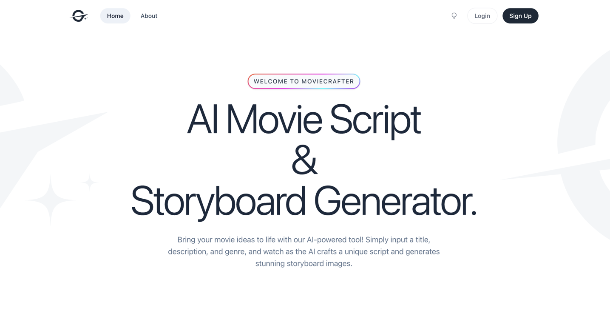

# 🎬 MovieCrafter | AI Movie Script & Storyboard Generator
Welcome to the AI Movie Script & Storyboard Generator – an innovative application built to streamline the process of creating movie scripts and visual storyboards using AI technology. This project was created as part of the DEV.to x Pinata Hackathon to showcase the powerful integration of Pinata for secure and efficient digital asset storage. 🚀



## 📖 Project Overview
Ever had a great idea for a movie but didn't know where to start? With this tool, you can input a movie title, short description, and genre, and let our AI models handle the rest! Using OpenAI GPT-4 and DALL-E 3, the app generates a fully-fledged movie script and accompanying storyboard images that bring your ideas to life. The storyboards are stored on Pinata Cloud using their Files API, ensuring they're accessible and securely stored.

## 🛠️ Technologies Used
This project is built using the following technologies:

- Laravel (TALL stack): Tailwind CSS, Alpine.js, Laravel, Livewire – creating a responsive and interactive frontend and a powerful backend.
- OpenAI GPT-4: For generating movie scripts from user-provided input.
- DALL-E 3: For creating visually engaging storyboard images.
- Pinata: For securely storing and managing the storyboard images via their Files API.

## ⚙️ Setup Instructions
Follow these steps to get the project up and running locally:

1. Clone this repository to your local machine.
2. Copy the .env.example file and rename it to .env. Fill in the necessary environment variables, including your API keys for OpenAI and Pinata.
```bash
cp .env.example .env
```
3. Install the PHP dependencies:
```bash
composer install && npm run build
```
4. Run the database migrations:
```bash
php artisan migrate
```
5. Start the Laravel development server:
```bash
php artisan serve
```
6. In a separate terminal session, start the queue worker for handling background tasks (image generation, etc.):
```bash
php artisan queue:work
```

## 🎉 About the Hackathon
This project was developed as part of the DEV.to x Pinata Hackathon, where developers create exciting applications using Pinata for decentralized file storage and management. The focus here is on leveraging Pinata to securely store and serve AI-generated storyboards for easy access, demonstrating how powerful and flexible these technologies can be.

## 🚀 Features
AI-powered script generation: Input a title, description, and genre, and let the AI write a compelling movie script.
Visual storyboarding: AI-generated images that illustrate key scenes in the movie.
Secure storage with Pinata: Storyboards are safely stored and served from Pinata, with secure signed URLs for access.
